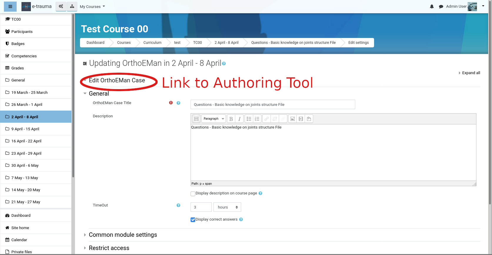
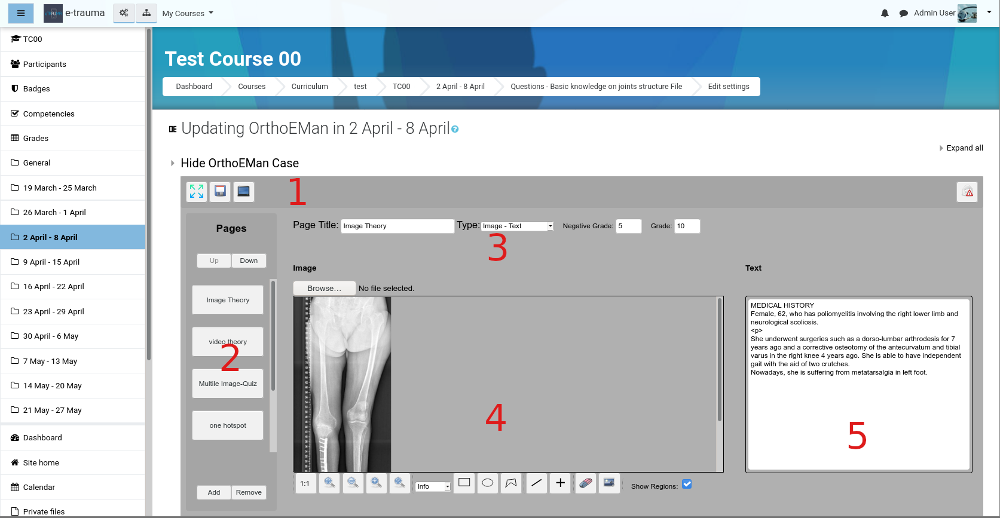
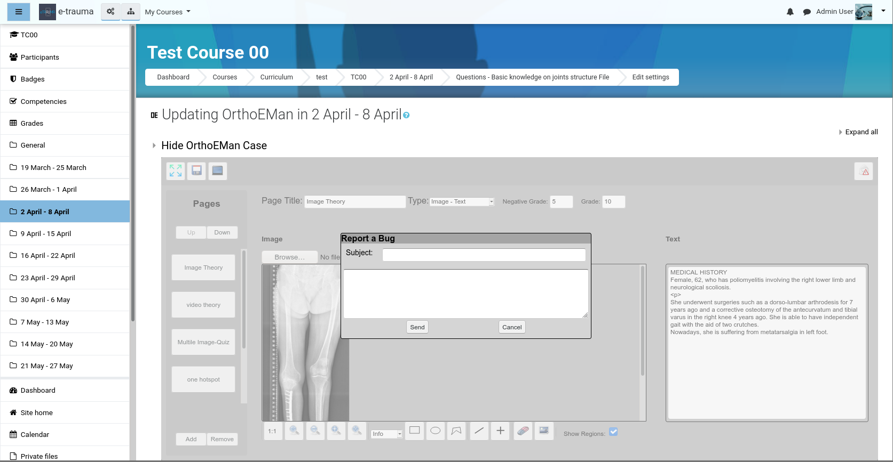
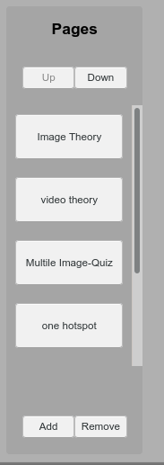
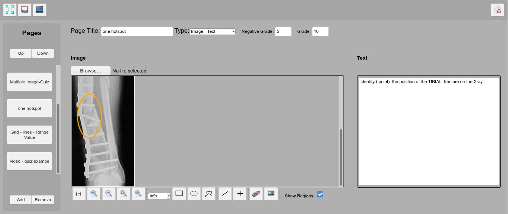
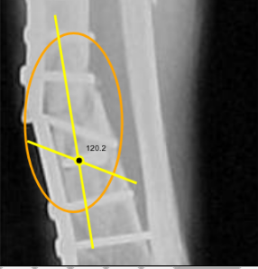
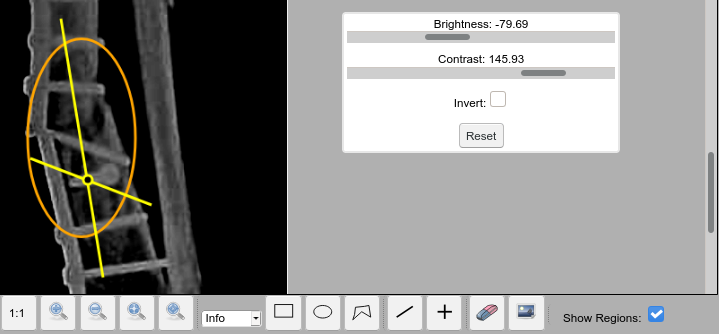
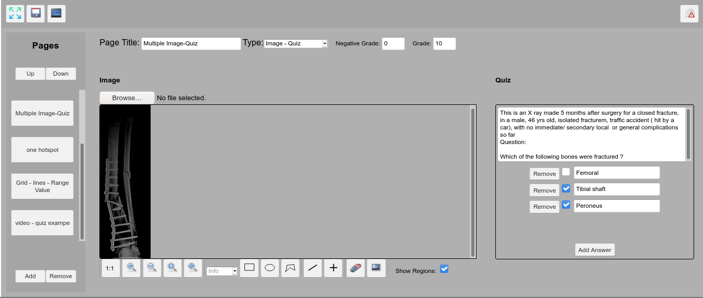
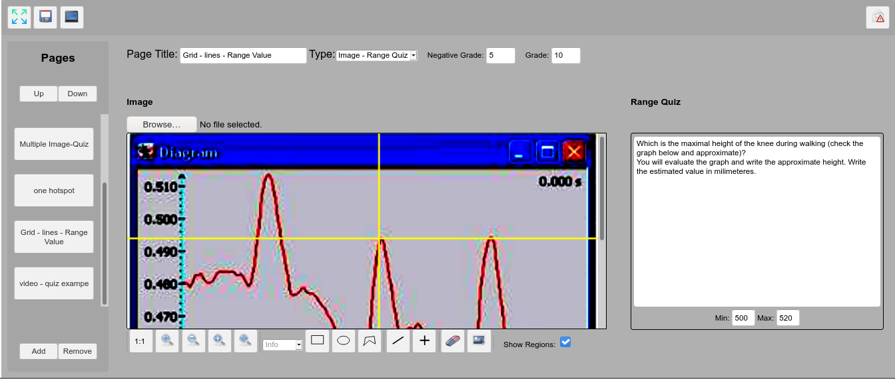

---
title: Authoring Tool
...

# Authoring Tool

## Introduction

The Authoring Tool is part of the orthoeman Moodle plugin and it designed
so  course creators (authors, teachers) can annotate media and create
quizzes based on them.

This document assumes that you have reached the point of creation of an
activity of type orthoeman.

## Entering Authoring Tool

The second time you visit the case configuration page you encounter a
page similar to the picture but with one important difference. In the
main area, at the start of the page, there is a link.

By clicking the link **Authoring Tool** will start in a frame inside
moodle. If screen estate proves to be scarce we may consider of having a
way starting **Authoring Tool** in a new page. Note also, that the way
of **Authoring Tool** invocation may change in general e.g. the link may
become a button in the middle of the page etc.

## First Contact

The **Authoring Tool** is a web based application that helps the author
to create or edit an **orthoeman** compatible case. In the figure below you
can see the opening screen for the program.

The main screen of the program is divided into the following areas:

  --- ---------------------------------------------
  1   Upper Toolbar
  2   Pages Container
  3   Page Area
  4   Media Container
  5   Non Media Container (Text, Quiz, RangeQuiz)
  --- ---------------------------------------------

  Table: Main areas of Authoring Tool

## Upper Toolbar

The toolbar hosts 4 visible buttons. From left to right the buttons are:

- **Fullscreen**: Enters fullscreen for screen real estate challenged displays

- **Save**: By pressing this the current state of the case is stored in the database case.

- **Preview**: Invokes the **Display Tool** so the course author can preview the
case from the student's point of view. The time indication is always reset
after the invocation as a teacher may take the exam as many he wishes.  The
**Display Tool** is either invoked in a different tab (or window) or it is
reloaded it if it has been already loaded once.

- **Report a Bug**: The button at the right side, with the warning sign and
the envelop, is for the user to inform the **orthoeman** plugin authors about an
unintended behavior of the program (namely a bug).  See the picture below
for an illustration of the bug reporting dialog.  When you are filing a bug
report try to be concise, short, and to the point.  In the subject type the
problem type you experience.  In the body of message make sure you mention:

    - What are you trying to do (intention of the user)
    - What are you actually doing (series of events and user actions)
    - How the computer responds (erratic (buggy) behavior)
    - How the computer should respond (expected (correct) behavior)

## Page Container

The page container contains the pages (slides) the author creates.
There are 4 buttons in two button areas.

- In the lower button area the **Add / Remove** button pair helps the author
to create new pages and remove unneeded ones.
- In the upper button area the **Up / Down** buttons
helps the author to properly position the current page with respect to
the other slides.

The pages are identified by their title. Note that the **Display
Tool** may not display the **page title**. Nevertheless a concise **page
title** is strongly advised to be entered in order to help author
organize the case and keep the overall overview. Note that the **page
title** inside the slide will be updated when the **Page Title** textbox
looses its input focus.

## Page Area

The page area is depicted below.

The page area has the following elements

- **Page Title**: identifies the page and it is displayed in the Pages
Container slide area for each page. It is strongly advised to enter
a short descriptive page title that will organize the case flow.
Note that the Display Tool may not display the Page Title text.
- **Page Type**: a combobox that identifies the page type. See below for a
discussion of the available page types.
- **Grade**: The grade of the page. The sum of all pages will be
normalized at the end anyway so it is possible to use any relative
value without worrying about normalization issues.
- **Negative Grade**: The punishment value that is subtracted from the
positive grade for a wrong answer.

## Media Container

The media container is the place where the image or the video is
displayed. There is an upload button that initiates the upload
procedure. In the case of image only **PNG** and **JPEG** image formats
are allowed. In case of video the following video types are allowed
(**MPEG**, **MOV**, **AVI**,and **MP4**). Note that **AVI** is not a
video format itself, but a container format meaning it may include
different video and audio encoding formats such as **divx**, **xvid**,
**theora**, etc\... In order for the video to be visible in modern HTML5
browsers it has to be trans-coded to **mp4** and to **webm** formats.
This operation may take several minutes and it is being done during
video upload. For a 10 second video a 90 second upload and trans-coding
time may be required depending on the server load. Also the operation
may fail if the original video format is not understandable by the
**ffmpeg** which is used on the server to perform the trans-coding. In
such a case you will have to resubmit the video using an alternative
format.

## Non Media Container

The **Non Media Container** contains the following widgets

-   **Text**: A text area for theory text, or instructions for the image
    hotspots.
-   **Quiz**: A multiple choice quiz. The widget supports arbitrary number
    of possible questions and arbitrary number of correct questions.
-   Range Quiz: A quiz that accepts as correct any answer in the
    specified range.

## Case structure

A **lesson** consists of a collection of **pages.** Currently there are
no limits in the number of pages a lesson can have. Each **page** has a
a **title** and two **items** that should be edited and populated with
the author\'s content. The left panel of the application is responsible
for the management of the pages. There are buttons for adding and
removing pages and buttons for page reordering. The content item can be
of the following type:

-   Text
-   Image
-   Video
-   Quiz
-   RangeQuiz

However not all item type combinations are valid. A page can only have
one the following item type combinations.

-   Image -- Text
-   Image -- Quiz
-   Image -- Range Quiz
-   Video -- Text
-   Video -- Quiz
-   Text -- Quiz

A **page **is characterized by its title and by its type (the
combination of item types)

### Image -- Text

The **Image -- Text** page type used for two types of pages:

-   Theory pages with informational areas pointed
-   Hotspot identification by the students as it is depicted in the
    picture below.

The hotspots are drawn with a orange pen while the informational areas
are drawn with blue pen. (consult the color map table below for
reference). The choice where a drawing will be hotspot or informational
is selected with the combobox in the middle of the tools as it is shown
above. The difference is that hotspots are expected to be found by the
students during the exam while the informational areas are shown to
exemplify aspects of the theory.

  --------------- --------
  Hotspot         Orange
  Informational   Blue
  Helper          Yellow
  Eraser          Red
  Other uses      Black
  --------------- --------

Table: Color Map Table

The image container sports several tools in order to help the author
properly annotate the image.

From left to right:

-   **1-1**: Removes all scaling. Every pixel of the image corresponds
    to one pixel of your viewing area.

-   **Zoom In**:. Zooms in by 20%.

-   **Zoom Out**: Zooms out by 20%.

-   **Zoom To Fit width**: Scales the image to fit in the width of your
    client area of your browser. This is the default behavior when an
    image is uploaded.

-   **Zoom To Target**: Requests from the user to draw a rectangle and
    then zooms to it.

-   **Drawing Type combobox**: Select if the next drawing area will be a
    hotspot or an informational area.

-   **Rectangle**: Draws a rectangle.

-   **Ellipse**: Draws an ellipse.

-   **Polygon**: Draws a polygon as a series of points. When the mouse
    hovers over the first point (within a range of 20 pixels) then a
    circle is drawn to indicate that the polygon will be closed.
    Although it is possible to create non convex polygons with this
    freehand drawing they should be avoided as it is possible to confuse
    the hotspot detection algorithm of the plugin.

-   **Line**: Draws a line. Lines are helper elements and they are
    painted with a yellow pen. Lines are not displayed in the **Display
    Tool. **If multiple lines are drawn and the mouse hovers over an
    intersection the automatic angle calculation tool kicks in and
    displays the angle in degrees.

    

-   **Crosshair Tool**: Draws a croshair tool. Again this is a helper
    tool and it is painted with a yellow color meaning it is not
    displayed in the **Display Tool**.

-   **Eraser**: Paints with red every drawing when mouse hovers near it.
    When in red a click remove the drawing from the image. In order to
    remove multiple drawings a repeated selection of the **eraser** tool
    is required.

-   **Image Editing Tools**: Allows for brightness, contrast and image
    inversion control in order for medical finding to become apparent.

    

    -   **Show Regions checkbox**: Specifies if the hotspots will be
    displayed from the **Display Tool **during the exam after student\'s
    answer submission.

### Image -- Quiz

In the image below the **Image -- Quiz** combination is depicted. When
the quiz is selected the hotspot functionality is disabled. Existing
hotspots are converted to informational drawings. The **quiz** widget is
shown in the right side of the **Authoring Tool.** The quiz supports
arbitrary number of possible questions and arbitrary number of correct
questions. The widget supports addition and removal of questions but not
reordering of the questions.

### Image -- Range Quiz

The **Image -- Range Quiz** page type asks from the student to submit a
value. The authoring teacher specifies in the right side panel the range
of acceptable answers. Before entering the range the teacher should also
type in a descriptive question just above the range. Make sure that
units are properly specified in the question and in the entered region
since the student can only type raw numbers.

### Video -- Text

The **Video -- Text** page type can be used only for theory and not for
student\'s evaluation. The authoring teacher provides a video (be
patient during upload and trans-coding) and a text description
highlighting the relevant points.

### Video -- Quiz

The **Video -- Quiz** page type is like the **Image -- Quiz** where the
authoring teacher specifies a multiple choice for the student to answer.

### Text -- Quiz

The **Text -- Quiz** page type is a classic non multimedia quiz where
the student can be examined in theory.
