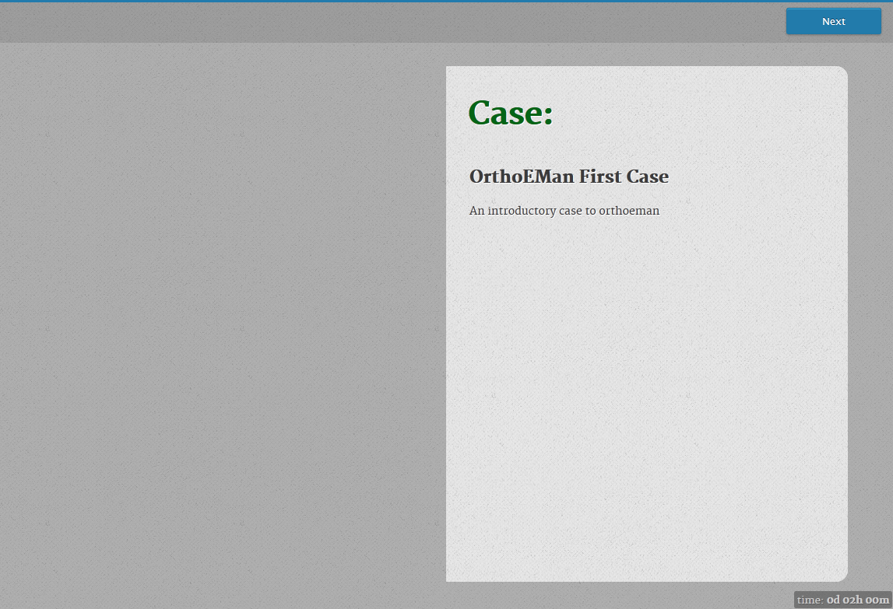
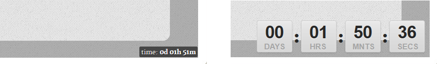
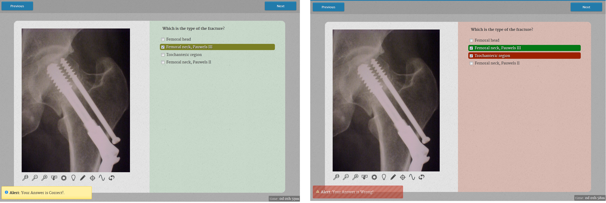
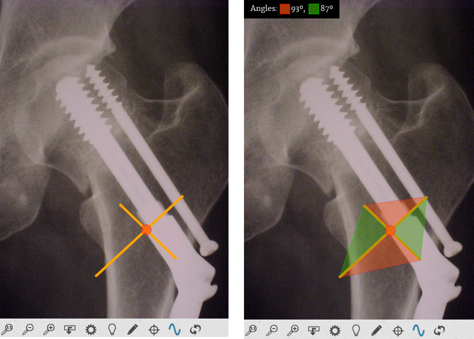
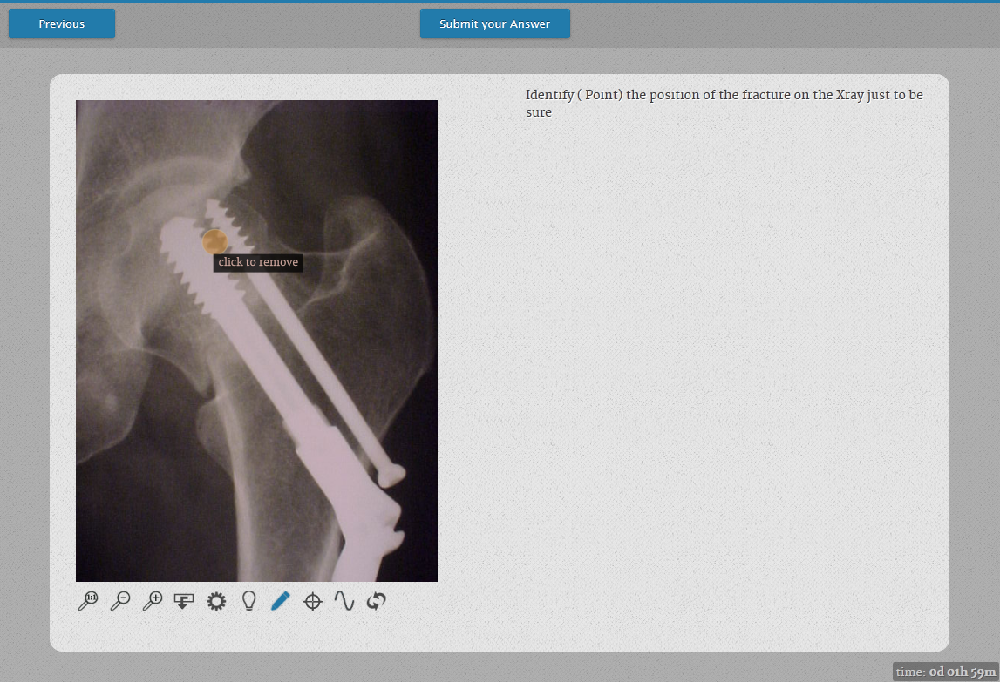
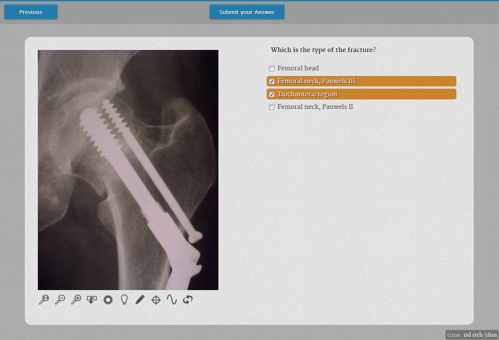
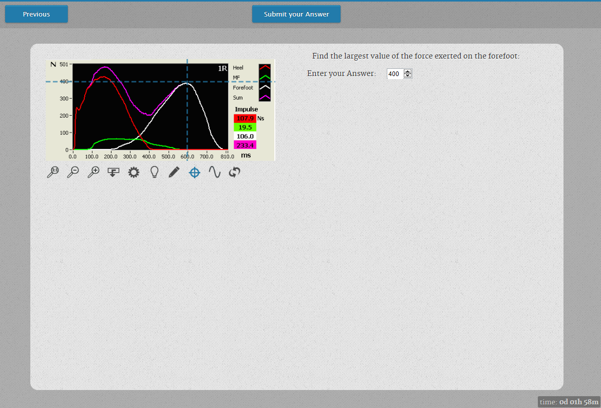
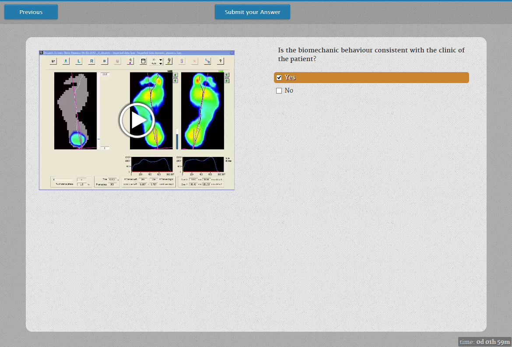

---
title: Display Tool
...

# Display Tool

## Introduction

The **Display Tool** is the main interface point with the student. The
student invokes the Display Tool by just selecting the appropriate
activity in the lesson.

## First Contact

The title and the case's description that are displayed in the initial
screen of the **Display Tool** have been entered in case configuration
page as it is illustrated at Illustration.

The student can navigate between pages by using the buttons on the upper
part of the screen. The clock that shows the remaining time for the
lesson completion is displayed in the lower-right part of the screen. It
has two mode: the compact mode which it is the default and the expanded
mode which it is evoked by clicking the compact clock. Illustration 2
shows these two clock versions.

## Pages Types

A lesson consists of a collection of pages. Each page may contain theory or
questions towards the students. The pages that are compose of questions
expect feedback from the student. Depending of the page type the answers
are ranging from selecting the correct hotspots in an image to picking
up the correct phrases(quiz). Then, the Display Tool informs the student
if his answer is correct or wrong (Illustration (a) and (b)). The
Display Tool may provide the correct answer if the student answer it
wrong but only by the teacher consent.

### Image - Text

The **Image - Text** page type is used to present theory pages which
they contain just an image and text. Moreover, it may used for hotspot
identification by the students.

When a page contains an image, the student has in his disposal a number
of tools in order to manipulate the image to help him answer the
question. Illustration depicts those tools. From left to right:

-   **1-1**: Removes zooming scaling. Resets images dimensions to the
    original values.
-   **Zoom In**:. Zooms in by 20%.
-   **Zoom Out**: Zooms out by 20%.
-   **Invert:** Invert the image colors.
-   **Brightness**: Change the image brightness.
-   **Contrast**: Change the image contrast.
-   **Hotspot** **Selector**: By pressing this button, the student will
    be able to create points in the image suitable for the hotspot
    identification questions.
-   **Crosshair Tool**: Draws a crosshair tool across the image.
-   **Line**: Draws a line. Lines are helper elements for the students
    and they are painted with a yellow pen. If multiple lines are drawn
    and the mouse hovers over an intersection the automatic angle
    calculation tool kicks in and displays the angle in degrees
    (Illustration ).
-   **Reset**: Resets the image to original state. Removes the
    Brightness/Contrast and Invert effects.

The Illustration shows the **image - text** page type when involves
hotspot identification. The student by pressing the **Hotspot Drawing
Tool** must point in the image the correct area. The number of required
hotspots are defined from the question. The hotspot can be deleted by
hovering the mouse cursor over it and pressing the left button. When the
required hotspots are created by the student, the "Submit your Answer"
button appears and the answer is ready to be send.

### Image - Quiz

The image (Illustration ) shows how **Display Tool** illustrates the
**Image - Quiz** page type. The student can select one or more choices
from the available answers. When at least one answer is selected, a
button labeled "Submit your Answer" will appear. The student by pressing
this button, he submit his answer.

### Image - Range Quiz

The I**mage - Range Quiz** page type requires the student to submit a
value by studying the associate image and deduce from it the correct
answer. He has in his disposal all the image tools that are described
earlier (including the cross-line mode) to figure out the answer. When
he enters a value the "Submit your Answer" button appears so that he may
submit it.

### Video - Text

The **Video - Text** page type is used only for theory and not for
student\'s evaluation. It is not requires any action from the student.
The authoring teacher provides a video and a text that highlights the
more relevant points of it.

### Video - Quiz

The **Video - Quiz** page type is like the Image - Quiz, where instead
of an image there is a video. The student can watch the accompany video
and then, he must select one or more choices from the available answers.
When at least one answer is selected, a button labeled "Submit your
Answer" will appear. The student by pressing this button, he submit his
answer.

### Text - Quiz

The Text - Quiz page type is a classic non-multimedia quiz where the
student reads the question and the accompany theory and selects one or
more answers from the provided answers.

